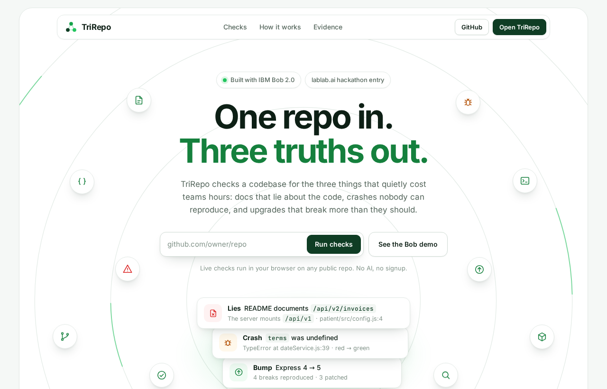
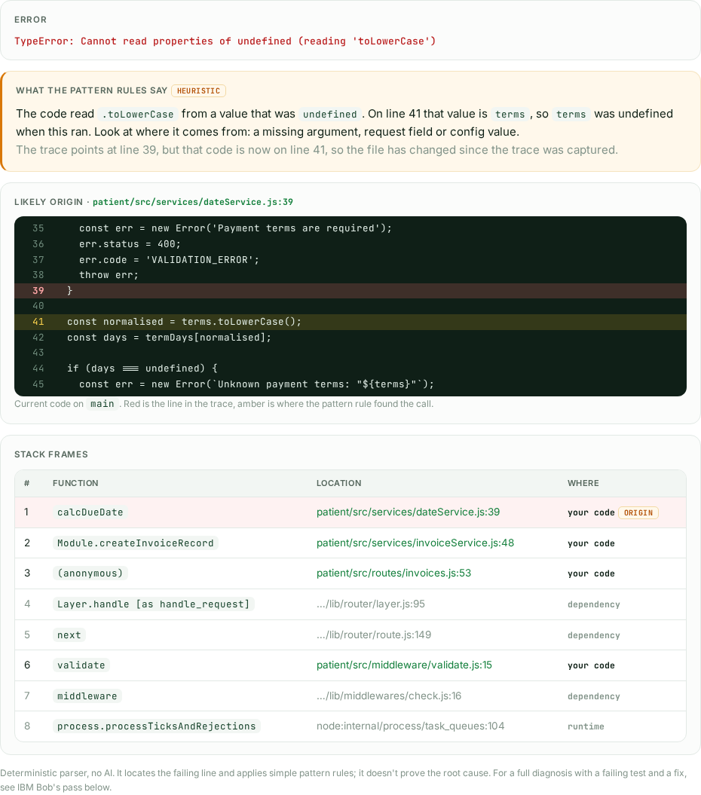
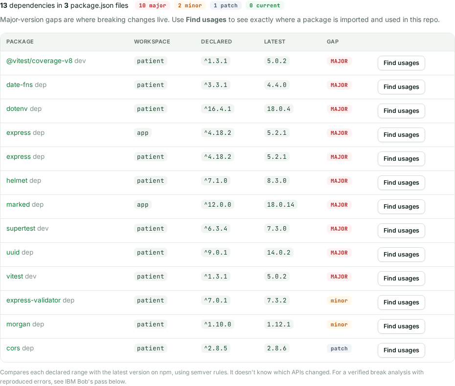

<p align="center">
  <picture>
    <source media="(prefers-color-scheme: dark)" srcset="docs/images/landing-dark.png">
    
  </picture>
  <br>
  <sub>The landing page. Paste a public GitHub repo and click <b>Run checks</b>, or open IBM Bob's deep pass on the sample repo. Light and dark themes; the toggle is in the top bar.</sub>
</p>

# TriRepo

**One repo in. Three truths out.**

TriRepo checks a codebase for the three things that quietly cost teams hours: docs
that lie about the code, crashes nobody can reproduce, and upgrades that break more
than they should. It was built for the IBM Bob 2.0 hackathon on lablab.ai.

Each check runs **live** in your browser against any public GitHub repo, and each one
has a **deep pass** by IBM Bob 2.0 behind it, run on `patient/`, a sample app with
planted problems.

| Check | The question | Live, on any public repo | Bob's deep pass on `patient/` |
|-------|--------------|--------------------------|-------------------------------|
| **LIES** | Where do the docs contradict the code? | README, CONTRIBUTING and package.json: script names, Node version, ports | 11 contradictions found, 3 fixed, 8 left documented |
| **CRASH** | Given a stack trace, where did it fail and why? | Parses Node, Python, Java, Go and Ruby traces and opens the failing line on GitHub | Root cause found from the trace alone; failing test written, then fixed |
| **BUMP** | What breaks in this repo if we upgrade? | Every dependency against the latest on npm, major-version gaps flagged, **Find usages** | Express 4 → 5: 4 breaks reproduced on real Express 5, 3 patched |

---

## Try it

1. **Open TriRepo.** Locally that's `http://localhost:4000` (see [Run it locally](#run-it-locally)).
   The landing page is at `/`; the tool itself, the clinic, is at `/app`.
2. **Paste a public GitHub repo** and click **Run checks**. Lies runs straight away and
   Bump warms up in the background. For Crash, paste a stack trace into the Crash tab.
3. **Read Bob's deep pass.** Click **See the Bob demo** on the landing page, or
   **Load demo** in the clinic.

> **Judges:** start on the landing page, then click **See the Bob demo**. For live
> runs, the landing page has one-click links: **Try the sample crash** and
> **Scan this repo**. Or paste this repo into the box:
> `https://github.com/TeevincsCrypt/TriRepo`.

---

## Run it locally

You need Node.js 18 or newer.

```bash
npm install            # installs the UI and the patient app (npm workspaces)
npm run ui             # TriRepo on http://localhost:4000
npm run test:patient   # the patient app's test suite: 35 of 35 pass
```

`npm run patient` starts the sample app itself on `http://localhost:3000`.

---

## The three checks

### Lies: docs vs code

- **Live:** fetches the repo's README, CONTRIBUTING.md and package.json and flags
  documented `npm run` scripts that don't exist, Node versions that don't match
  `engines`, and ports that don't match `config.port` in package.json.
- **Bob's deep pass:** two parallel subagents, one reading only the docs and one reading
  only the code, then a diff of the two. Bob fixed the 3 safest contradictions and left
  the other 8 documented, including two CHANGELOG errors that were never planted.
  Report: [`reports/lies.md`](reports/lies.md).

### Crash: stack trace → failing line



*The live Crash tool on the sample trace. It names the error, works out that `terms`
was undefined, and shows the code at the failing line: red is the line in the trace,
amber is where the call sits now. Below that, every frame is split into your code and
dependencies, each linked to its line on GitHub.*

- **Live:** paste any stack trace. TriRepo separates your code from dependency and
  runtime frames, finds each file in the repo, shows the code at the failing line, and
  applies plain pattern rules to the error. On the sample trace it works out that
  `terms` was undefined, and notes that the line has moved since the trace was captured.
- **Bob's deep pass:** started from [`patient/CRASH.txt`](patient/CRASH.txt) alone,
  traced the root cause, wrote a test that failed (red), fixed the code, and confirmed
  green, with the full suite at 35/35. Report: [`reports/crash.md`](reports/crash.md).

### Bump: upgrade blast radius



*The live Bump tool on this repo: 13 dependencies across 3 package.json files, 10 of
them a major version behind, where breaking changes live. Find usages lists every file
and line that imports a package.*

- **Live:** reads package.json, following workspaces, compares every dependency with the
  latest version on npm, and flags major-version gaps. **Find usages** lists every file
  and line that imports a package.
- **Bob's deep pass:** inventoried every Express call site in `patient/src`, reproduced 4
  breaks against a real Express 5 install, patched 3 so they work on both versions, and
  left the silent one documented. Reports: [`reports/bump.md`](reports/bump.md) and
  [`patient/UPGRADE.md`](patient/UPGRADE.md).

---

## The patient

[`patient/`](patient/) is **Vaultline**, a small Express 4 invoice API with 35 tests and
problems planted on purpose: documentation that lies, one realistic crash (with a real
captured trace in `patient/CRASH.txt`), and APIs that break on Express 5.

[`patient/PLANTED.md`](patient/PLANTED.md) is the answer key. It was written only after all
three passes, so Bob couldn't read the answers early, and it lists separately what Bob
found that was never planted.

---

## How it was built

Each check ran as its own IBM Bob 2.0 task, moving from Ask to Plan to Agent, with
parallel subagents where the work split cleanly. A fresh task for each pass meant the
later passes had no memory of what Pass 0 had planted.

| Part | Built with |
|------|-----------|
| `patient/`: the app, its tests and the planted problems | IBM Bob 2.0 (Pass 0) |
| The three deep analyses in `reports/` and every fix in `patient/` | IBM Bob 2.0 (Passes 1–3) |
| `prompts/`, the docs, the original TriRepo UI and the live Lies check | IBM Bob 2.0 |
| The live Crash and Bump tools, the landing page and the white-and-green design (`app/public/`) | Claude Code, after the Bob allowance ran out |

The evidence is in [`bob_sessions/`](bob_sessions/): 13 session screenshots, grouped by
pass. [`HACKATHON.md`](HACKATHON.md) has the full account, including exactly which files
were written after Bob. The operator approved edits, ran commands and captured
screenshots; no code was written by hand.

---

## Under the hood

- **One Express server,** [`app/server.js`](app/server.js):
  - `/` serves the landing page.
  - `/app` serves the clinic, which renders `reports/*.md` with `marked` on every request, so there's no build step.
  - `/api/proxy` forwards to `raw.githubusercontent.com` and `registry.npmjs.org` only, over https, when a direct browser fetch fails.
  - `/api/sample-trace` serves `patient/CRASH.txt`.
- **The live checks run in the visitor's browser.** Crash and Bump live in
  [`app/public/live-tools.js`](app/public/live-tools.js); Lies is inline in
  `server.js`. There's no database and no login, and nothing is stored.
- **Deep links:** `/app?repo=<url>` runs the checks, `/app?tab=crash&sample=crash` traces
  the sample crash, and `/app?tab=bump&repo=<url>` scans a repo's dependencies.
- **Light and dark themes.** Light is the default. The toggle in the top bar switches
  theme, and the choice is remembered across both pages
  ([`app/public/theme.js`](app/public/theme.js)).

### Limits of the live checks

- Public GitHub repos only. Lies and Bump need an npm project with a package.json at
  the root; Bump follows its workspaces.
- They use GitHub's API without a login, which allows 60 requests an hour per visitor.
  If the API is unavailable, Crash finds files by probing instead, Bump turns off Find
  usages, and both say so.
- Bump compares version ranges using semver rules. It doesn't know which APIs changed.
  Find usages follows imports and direct uses of the imported name, across up to 300
  source files.
- Crash's pattern rules point at the failing line and the likely culprit. They don't
  prove the root cause; that's what Bob's deep pass is for.

---

## Deploying

Any Node host works. Deploy the whole repo, since the server reads `../reports` and
`../patient`. Run `npm install`, then start it with `npm run ui`. The server listens on
`$PORT` and defaults to 4000. The live demo runs on Railway.

---

## Project structure

```
TriRepo/
  README.md                ← you are here
  HACKATHON.md             ← the full hackathon write-up: passes, Bob features, authorship
  LICENSE                  ← MIT
  package.json             ← npm workspaces: app/ and patient/
  app/
    server.js              ← Express server: landing page, clinic, proxy
    public/                ← landing page, styles, live Crash and Bump tools
  patient/                 ← Vaultline, the sample app under test
    CRASH.txt              ← the real stack trace the Crash pass started from
    PLANTED.md             ← the answer key, written after all three passes
    UPGRADE.md             ← Bob's Express 4 → 5 upgrade guide
  reports/
    lies.md, crash.md, bump.md   ← Bob's three deep-pass reports
  prompts/                 ← the prompts behind each Bob pass, re-runnable
  bob_sessions/            ← 13 screenshots of the Bob sessions, with an index
  demo/                    ← recording checklist
  docs/images/             ← screenshots used in this README
```

---

## License

MIT. See [`LICENSE`](LICENSE).
