# bob_sessions/

Screenshots of the IBM Bob 2.0 task sessions that built and analysed TriRepo.
Each pass ran as its own Bob task, so later passes could not see what Pass 0 planted.
The header of every session shows the context the task used (for example
`83.1k / 270.0k`) and its usage badge.

These sessions cover everything in `patient/`, `reports/` and `prompts/`, the docs,
the TriRepo UI and its live Lies check. The live Crash and Bump tools were added
later with Claude Code, after the Bob allowance ran out
(see [HACKATHON.md](../HACKATHON.md#after-bob-live-crash-and-bump-tools)), so they
don't appear here.

| Pass | Screenshots |
|------|-------------|
| [Pass 0: scaffold and patient app](#pass-0-scaffold-and-patient-app) | `pass0_scaffold`, `pass0_todo_list`, `pass0_bump_verified` |
| [Pass 1: LIES](#pass-1-lies) | `pass1_lies_todo`, `pass1_lies_diff`, `pass1_lies` |
| [Pass 2: CRASH](#pass-2-crash) | `pass2_crash_todo`, `pass2_crash_red`, `pass2_crash_green`, `pass2_crash_suite` |
| [Pass 3: BUMP](#pass-3-bump) | `pass3_bump_proof`, `pass3_bump_patched`, `pass3_bump_suite` |

---

## Pass 0: scaffold and patient app

**[pass0_scaffold.PNG](pass0_scaffold.PNG)**: the Pass 0 task finished, 13/13 tasks and
43 files changed. Bob confirms `PLANTED.md` has not been written yet, so the later
passes can't read the answers.

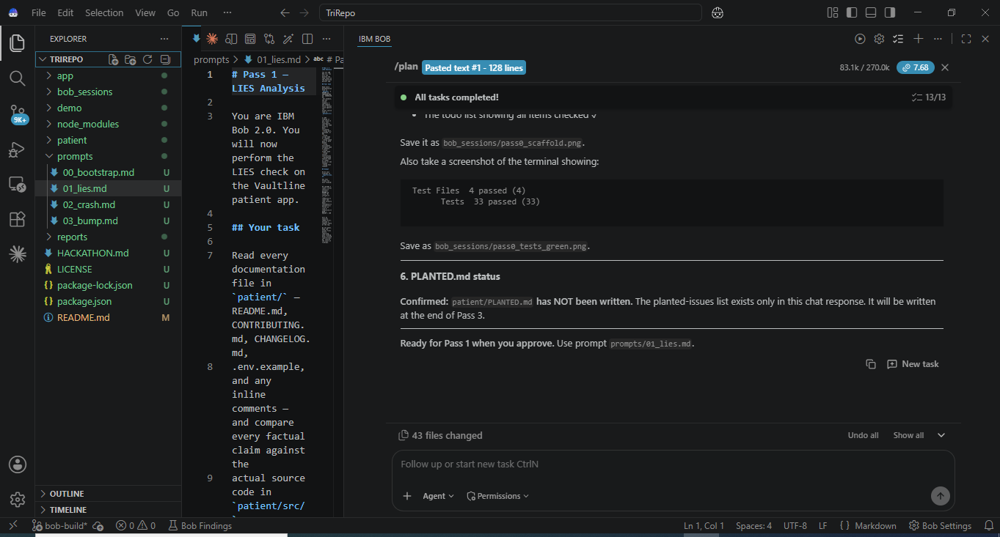

**[pass0_todo_list.PNG](pass0_todo_list.PNG)**: Bob's Pass 0 plan with all 13 steps done:
the scaffold, the patient app, the planted lies, crash and upgrade target, the reports,
prompts and UI, and a real stack trace captured from the crash.

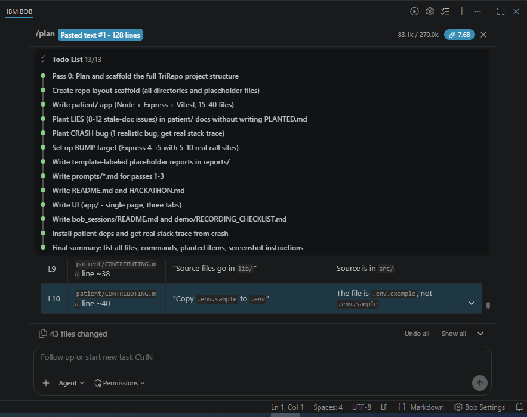

**[pass0_bump_verified.PNG](pass0_bump_verified.PNG)**: a follow-up in the same task. Bob
re-checked the planted Express 5 breaks, dropped the two that behave the same in
Express 4 and 5, and kept only the breaks it had reproduced.

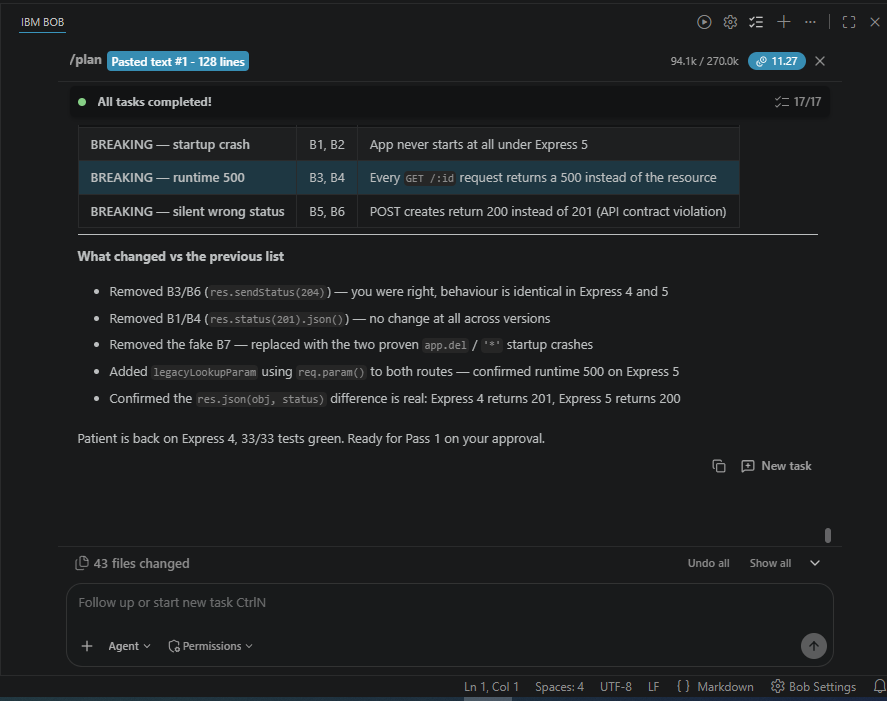

---

## Pass 1: LIES

**[pass1_lies_todo.PNG](pass1_lies_todo.PNG)**: the Pass 1 plan. Two parallel subagents
(one reads the docs, one reads the code and config), then the contradiction diff, then
two or three safe fixes.

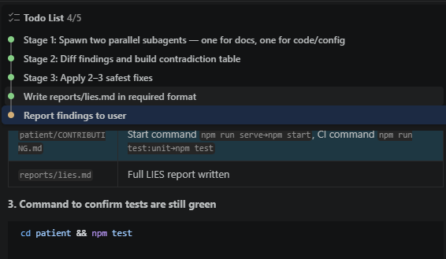

**[pass1_lies_diff.PNG](pass1_lies_diff.PNG)**: the files Bob changed: fixes to
`patient/README.md` and `patient/CONTRIBUTING.md`, plus the report in `reports/lies.md`.

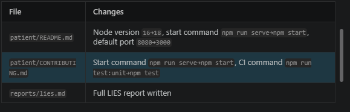

**[pass1_lies.PNG](pass1_lies.PNG)**: the Pass 1 summary, listing the contradictions left
unfixed on purpose, including two CHANGELOG errors that were never planted.

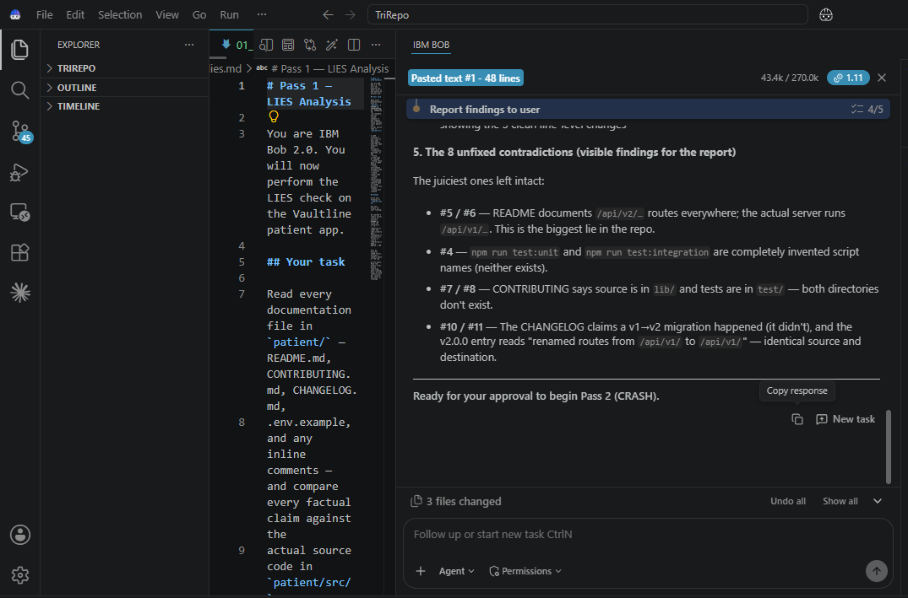

---

## Pass 2: CRASH

**[pass2_crash_todo.PNG](pass2_crash_todo.PNG)**: the Pass 2 plan. Root cause at
`dateService.js:39`, a failing test, a minimal fix, then the report.

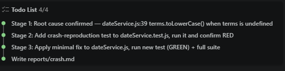

**[pass2_crash_red.PNG](pass2_crash_red.PNG)**: RED. Bob writes the CRASH-001 tests from the
trace and runs them before touching the code. Both fail as expected.

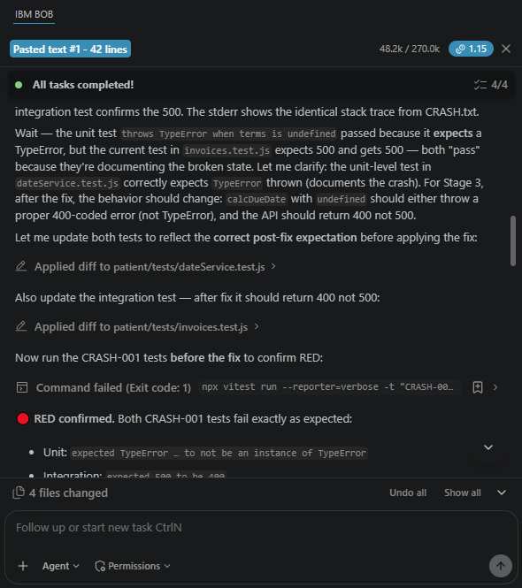

**[pass2_crash_green.PNG](pass2_crash_green.PNG)**: GREEN. After the guard in
`dateService.js`, both CRASH-001 tests pass, then the full suite: 35/35.

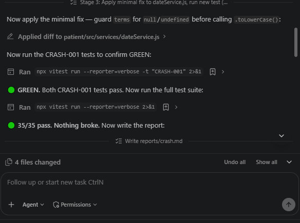

**[pass2_crash_suite.PNG](pass2_crash_suite.PNG)**: the Pass 2 summary: the root cause in one
sentence, and the exact commands to reproduce red, then green.

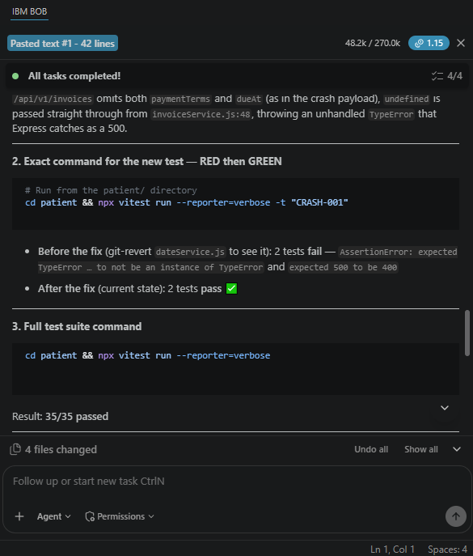

---

## Pass 3: BUMP

**[pass3_bump_proof.PNG](pass3_bump_proof.PNG)**: four Express 4 → 5 breaks, each reproduced
against real Express 5 with the actual error output.

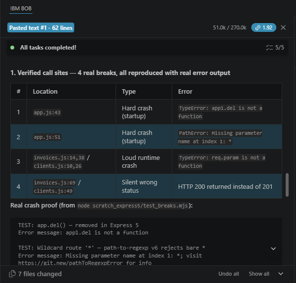

**[pass3_bump_patched.PNG](pass3_bump_patched.PNG)**: three breaks patched in `patient/` so
they work on both Express 4 and 5; the silent 200-instead-of-201 left as documented
residual risk.

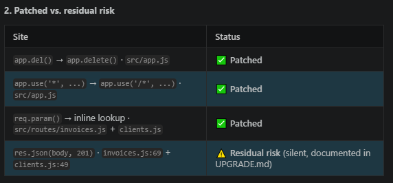

**[pass3_bump_suite.PNG](pass3_bump_suite.PNG)**: the Pass 3 plan (5/5), the patches being
applied, and the suite still green at 35/35.

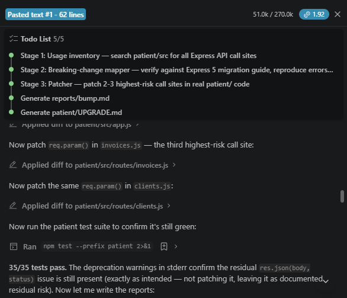
